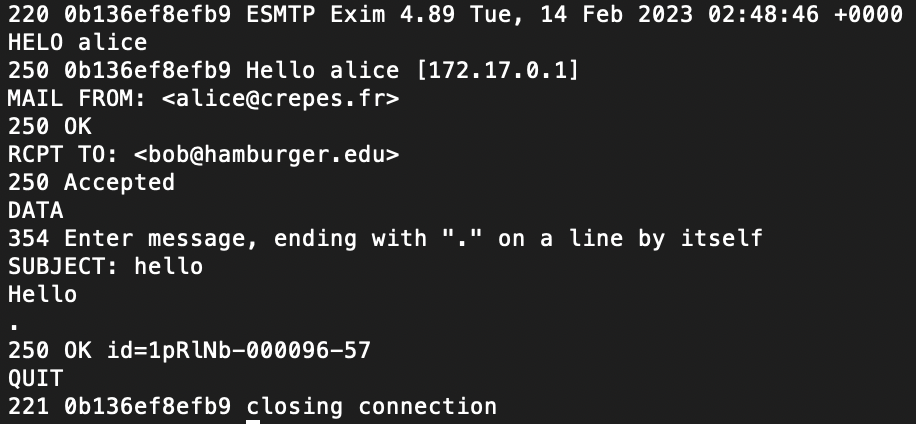

# SMTP Protocol
This program manually sends mail through an SMTP mail server
on port 25 by creating a TCP socket as a client, sending 
the necessary commands according to te SMTP protocol, and making sure
the correct response codes are received from the mail server.

To test the code locally, you can use the metasploitable vm
[(Download Metasploitable2 Virtual Machine)](https://sourceforge.net/projects/metasploitable/files/latest/download)
which has a configured SMTP server running on it. Alternatively, you could
use [Docker](https://www.docker.com/products/docker-desktop/) 
and run it in a container. An example of such SMTP
interaction looks like this:

